#  科学上网【自建 OVZ 机型的 VPS 】

[toc]

- [科学上网【自建 OVZ 机型的 VPS 】](#科学上网自建-ovz-机型的-vps-)
  - [1、前言](#1前言)
  - [2、使用到的工具](#2使用到的工具)
  - [3、流程](#3流程)
    - [3.1、Namesilo](#31namesilo)
      - [3.1.1、身份认证](#311身份认证)
      - [3.1.2、 DNS管理](#312-dns管理)
    - [3.2、Cloudflare](#32cloudflare)
      - [3.2.1、注册](#321注册)
      - [3.2.2、添加站点](#322添加站点)
      - [3.2.3、选择（Free）计划](#323选择free计划)
      - [3.2.4、查看记录](#324查看记录)
      - [3.2.5、更改您的名称服务器（完毕以后，需要刷新 Cloudflare ，检查是否生效）](#325更改您的名称服务器完毕以后需要刷新-cloudflare-检查是否生效)
      - [3.2.6、成功生效](#326成功生效)
    - [3.3、hosteons](#33hosteons)
      - [3.3.1、注册](#331注册)
      - [3.3.2、服务器的购买和设置](#332服务器的购买和设置)
      - [3.3.3、hosteons  ↔ Cloudflare](#333hosteons---cloudflare)
        - [3.3.3.1、进入 hosteons → DNS  → 添加记录](#3331进入-hosteons--dns---添加记录)
        - [3.3.3.2、检测二级域名是否成功](#3332检测二级域名是否成功)
    - [3.4、SSH工具连接 VPS](#34ssh工具连接-vps)
    - [3.5、部署`X-UI`](#35部署x-ui)
    - [3.6、访问`X-UI`面板](#36访问x-ui面板)
    - [3.7、申请SSL证书](#37申请ssl证书)
      - [3.7.1、在`FinalShell`下输入`x-ui`,调出`X-UI`的管理脚本，输入`16`](#371在finalshell下输入x-ui调出x-ui的管理脚本输入16)
      - [3.7.2、完成一些设置](#372完成一些设置)
        - [3.7.2.1、域名设置](#3721域名设置)
        - [3.7.2.2、密钥设置](#3722密钥设置)
        - [3.7.2.3、注册邮箱设置，即输入`Cloudflare`的用户名](#3723注册邮箱设置即输入cloudflare的用户名)
        - [3.7.2.4、相关日志打印](#3724相关日志打印)
      - [3.7.3、`/root/cert` 证书文件夹](#373rootcert-证书文件夹)
      - [3.7.4、`X-UI`面板证书设置](#374x-ui面板证书设置)
    - [3.8、在`X-UI`面板里面部署入站节点](#38在x-ui面板里面部署入站节点)
    - [3.9、使用`Qv2ray`](#39使用qv2ray)
      - [3.9.1、安装](#391安装)
      - [3.9.2、数据导入](#392数据导入)
    - [3.10、IP优选：套用CDN拯救线路](#310ip优选套用cdn拯救线路)
      - [3.10.1、准备工作](#3101准备工作)
        - [3.10.1.1、断开Qv2ray链接并删除(图略)](#31011断开qv2ray链接并删除图略)
        - [3.10.1.2、在X-UI面板-入站列表里面，删除刚才配置的节点(图略)](#31012在x-ui面板-入站列表里面删除刚才配置的节点图略)
      - [3.10.2、操作流程](#3102操作流程)
        - [3.10.2.1、打开DNS：Cloudflare，找到解析域名的地方，开启代理](#31021打开dnscloudflare找到解析域名的地方开启代理)
        - [3.10.2.2、Cloudflare里面SSL/TLS 加密模式设置为完全（严格）](#31022cloudflare里面ssltls-加密模式设置为完全严格)
        - [3.10.2.3、在`X-UI`面板里面建立`VLESS+WS+TLS`的代理节点](#31023在x-ui面板里面建立vlesswstls的代理节点)
        - [3.10.2.4、Cloudflare设置请求头](#31024cloudflare设置请求头)
        - [3.10.2.5、Cloudflare设置服务器地址](#31025cloudflare设置服务器地址)

## 1、前言

*资料来源*

[youtube/自建VPS科学上网节点！一个视频就够了！6.88RMB/月无限流量看8K！域名注册、解析、托管Cloudflare、证书申请、套用CDN！保姆级VPN搭建教程！（关联翻墙/VPS推荐/节点搭建）](https://www.youtube.com/watch?v=Stdj6U568S0)

[v2rayssr综合网/保姆级节点搭建！VPS、域名、CF、VLESS小白教程！1刀/月的VPS居然可以看8K？新手这一个教程就够了](https://v2rayssr.com/teach-vless.html)

*VPS 是什么？*

```
把一部服务器分割为多个服务器，每个服务器拥有自己独立的公网IP地址以及独立的操作系统
VPS 分国内的和国外的。国外的 VPS 就是我们科学上网所需要的 VPS
我们可以通过访问国外的 VPS 来访问 YouTube
通过这么一个中转站，我们可以访问被墙的资源
```

*特点*

```
1、无限流量
2、小白入门
3、价格便宜
```

## 2、使用到的工具

| 域名购买       | Namesilo          | https://www.namesilo.com                                     | 可以使用支付宝 |
| -------------- | ----------------- | ------------------------------------------------------------ | -------------- |
| CDN            | Cloudflare        | https://www.cloudflare.com/zh-cn/                            | 可以使用支付宝 |
| 服务器购买     | hosteons          | https://hosteons.com/                                        | 可以使用支付宝 |
| SSH工具        | FinalShell        | http://www.hostbuf.com/                                      | 免费           |
| 服务器监控工具 | X-UI              | apt update -y<br/>apt install -y curl socat<br/>bash <(curl -Ls https://raw.githubusercontent.com/vaxilu/x-ui/master/install.sh) | 免费           |
| SSL证书申请    | x-ui 和Cloudflare | 16                                                           | 免费           |

## 3、流程

### 3.1、Namesilo

#### 3.1.1、身份认证

**https://www.namesilo.com/account_profile.php**

```javascript
未完成身份认证的时候，购买域名完成以后，需要有身份认证

如果身份认证已通过，则https://www.namesilo.com/account_profile.php重定向为https://www.namesilo.com/account_home.php

注：身份认证不核验电话号码，但是必须全英文，不接受中文，地址随机英文字也可
```


#### 3.1.2、 DNS管理

**https://www.namesilo.com/account_domain_manage_dns.php**

*删除默认配置*


**自此，域名`jobs295060456.top`购买成功**

### 3.2、Cloudflare

**https://www.cloudflare.com/zh-cn/**

```
 Cloudflare 是一个内容分发网络，即CDN。对于我们搭建节点来说，就是一个转发的服务器。常规站就是我们本地数据和远程服务器数据进行交换即可，如果是套用 Cloudflare，我们的数据就可以通过Cloudflare进行转发。转发的网络速度受制于我们本地计算机👉🏻Cloudflare 的速度。本质来讲，一个优秀的VPS线路，通常来说是不需要数据的转发，但是对于低配 VPS 来说，使用 Cloudflare 以后，就会有意想不到的一些结果。

我们需要注册一个 Cloudflare，并把我们的域名托管到 Cloudflare 。也就是 Cloudflare 来接管我们的域名管理业务
就算我们不使用 Cloudflare 的 CDN 业务，域名托管到 Cloudflare 以后，也会加速 DNS 解析生效
```

#### 3.2.1、注册

略

#### 3.2.2、添加站点

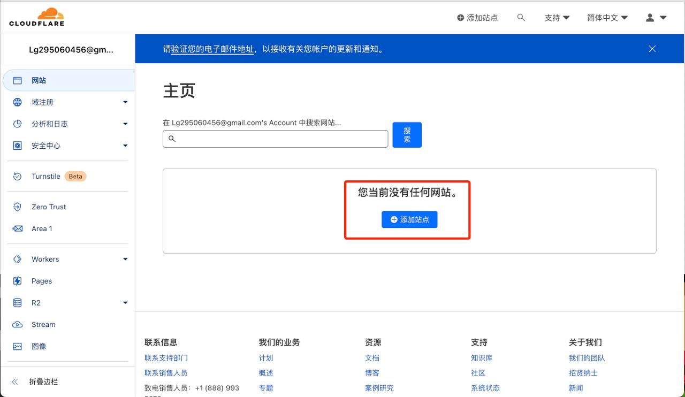

#### 3.2.3、选择（Free）计划

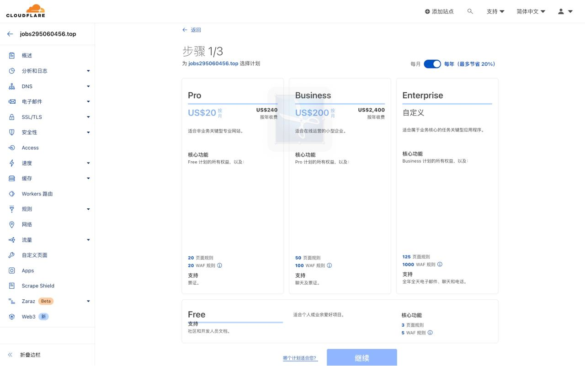

#### 3.2.4、查看记录


**点击`继续`**

#### 3.2.5、更改您的名称服务器（完毕以后，需要刷新 Cloudflare ，检查是否生效）


**自此，namesilo 完毕  ！！！相关功能被Cloudflare进行托管  ... 等待域名生效**

#### 3.2.6、成功生效


**同时，Cloudflare 的注册邮箱会受到一封生效的邮件**

### 3.3、hosteons

**https://hosteons.com/**

#### 3.3.1、注册

略

#### 3.3.2、服务器的购买和设置

*自行选择一款配置，支持支付宝购买*

```
root密码即为以后用SSH工具链接时用的密码
机房按需选择，这里选择LA（美国.加尼福尼亚.洛杉矶）
系统按需选择，这里选用debian 10
```


```
Primary IP
213.59.119.127
```

#### 3.3.3、hosteons  ↔ Cloudflare

##### 3.3.3.1、进入 hosteons → DNS  → 添加记录

**搭建 VPS 推荐使用二级域名**


**暂时关闭是为了演示一个不良效果**

##### 3.3.3.2、检测二级域名是否成功

```bash
➜  ~ ping hello.jobs295060456.top                      
PING hello.jobs295060456.top (213.59.119.127): 56 data bytes
64 bytes from 213.59.119.127: icmp_seq=0 ttl=44 time=219.361 ms
64 bytes from 213.59.119.127: icmp_seq=1 ttl=44 time=211.785 ms
64 bytes from 213.59.119.127: icmp_seq=2 ttl=44 time=215.781 ms
64 bytes from 213.59.119.127: icmp_seq=3 ttl=44 time=293.858 ms
64 bytes from 213.59.119.127: icmp_seq=4 ttl=44 time=311.871 ms
64 bytes from 213.59.119.127: icmp_seq=5 ttl=44 time=220.170 ms
64 bytes from 213.59.119.127: icmp_seq=6 ttl=44 time=250.909 ms
64 bytes from 213.59.119.127: icmp_seq=7 ttl=44 time=269.210 ms
^Z
[1]  + 21627 suspended  ping hello.jobs295060456.top
```

**🎉🍺 成功 🎉🍺**

### 3.4、SSH工具连接 VPS

*FinalShell*

```javascript
http://www.hostbuf.com/
http://www.hostbuf.com/t/988.html
```

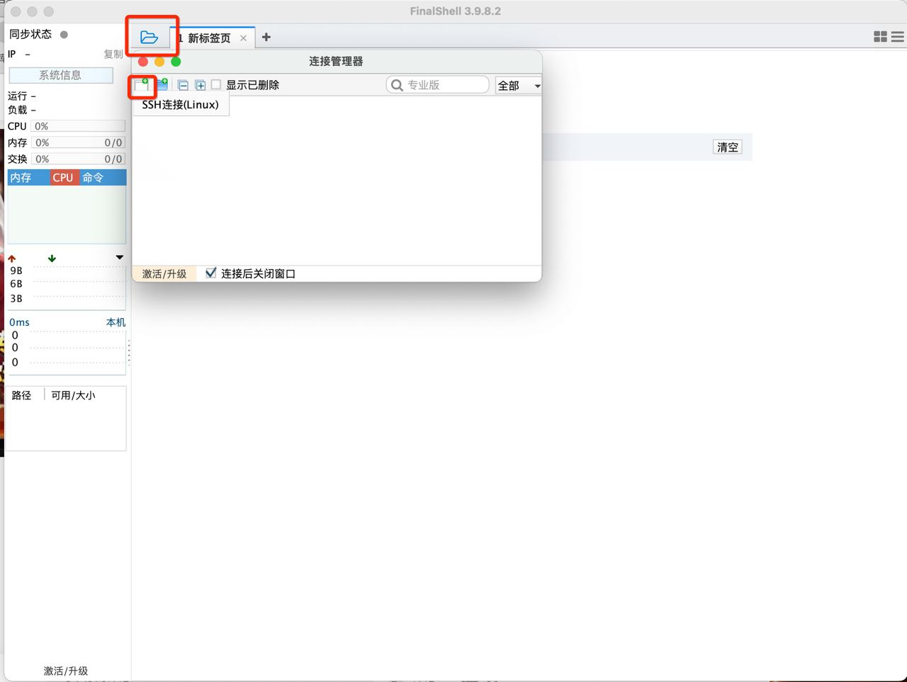


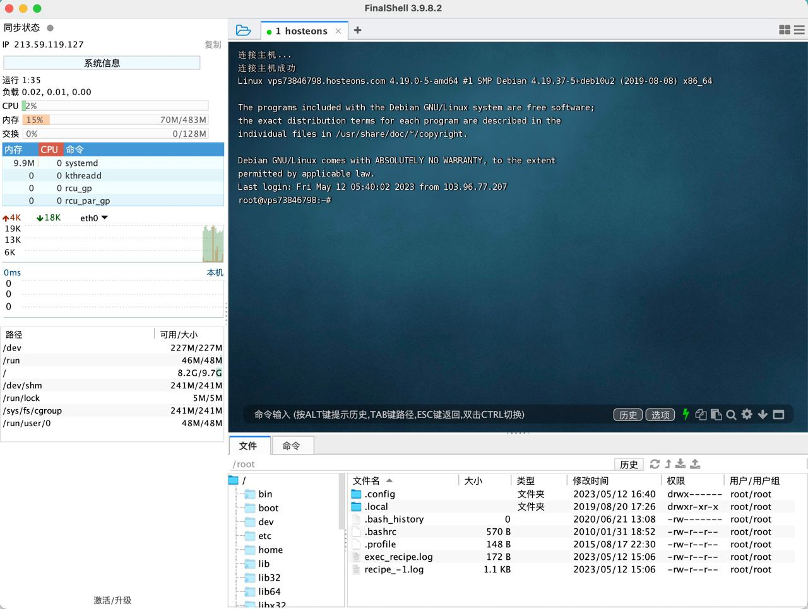

### 3.5、部署`X-UI`

*`X-UI`可视化节点部署的一个脚本*

*资料来源*

[科学上网：使用X-UI面板快速搭建多协议、多用户代理服务，支持CDN](https://coderfan.net/how-to-use-x-ui-pannel-to-set-up-proxies-for-bypassing-gfw.html)

```bash
apt update -y
apt install -y curl socat
bash <(curl -Ls https://raw.githubusercontent.com/vaxilu/x-ui/master/install.sh)
```

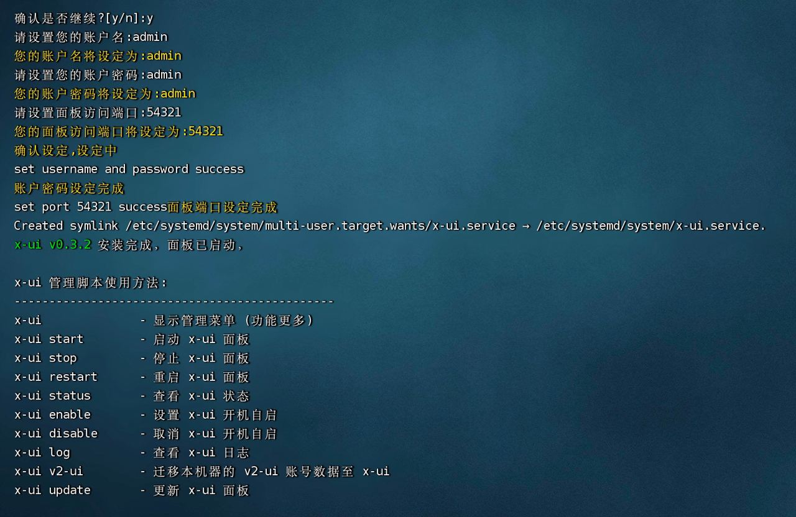

### 3.6、访问`X-UI`面板

*因为没有配置https证书，所以网页报红*

**VPS 公网IP + 刚设置的端口号54321，账密都是admin**

```javascript
open http://213.59.119.127:54321
```


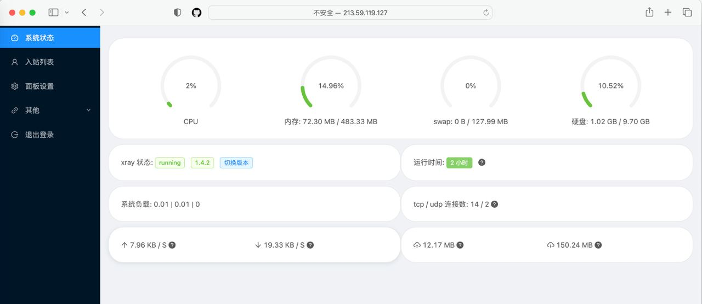

### 3.7、申请SSL证书

```
一个域名对应一个SSL证书
泛域名配置证书，也就是一个证书涵盖所有的泛域名
```

#### 3.7.1、在`FinalShell`下输入`x-ui`,调出`X-UI`的管理脚本，输入`16`

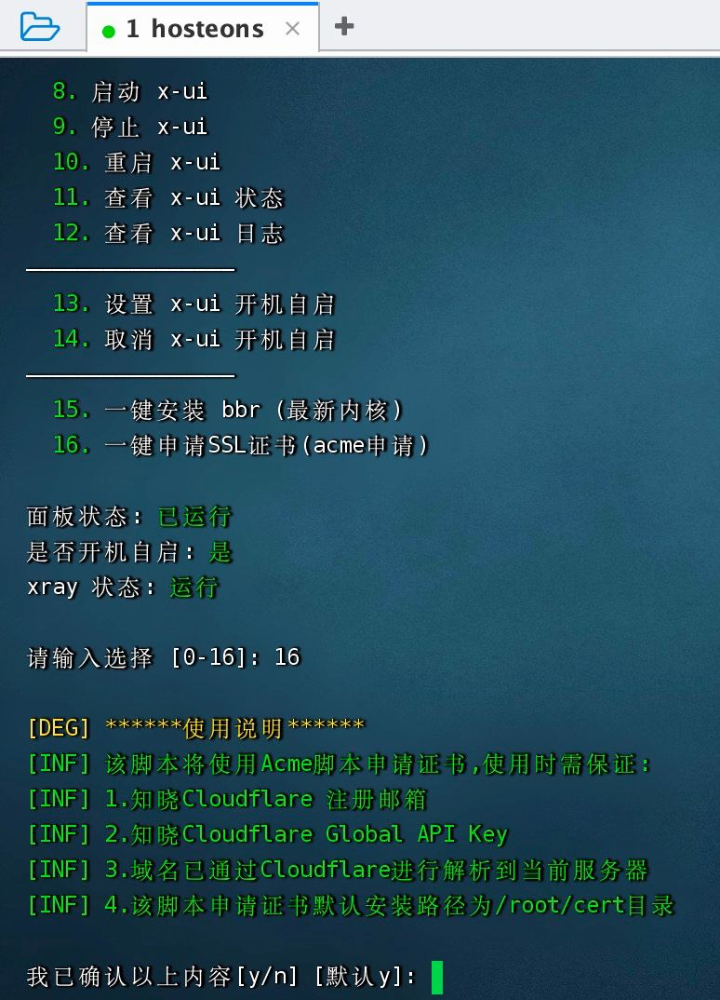

#### 3.7.2、完成一些设置

##### 3.7.2.1、域名设置

`jobs295060456.top`

##### 3.7.2.2、密钥设置

```
密钥位置: Cloudflare 👉🏻概述 👉🏻获取您的API令牌
```

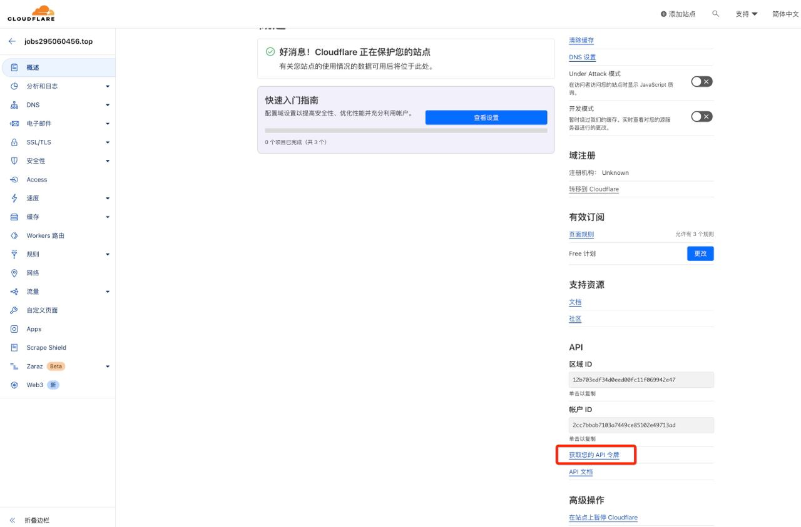

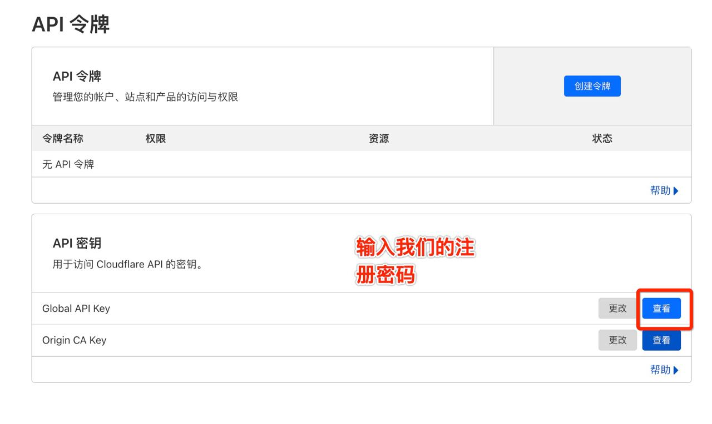

Api密钥：`4890192c37124e425dac15c55768117c954ad`

**注：查看Api密钥需要输入Cloudflare的登录密码，如果报错，请尝试重置登录密码**


##### 3.7.2.3、注册邮箱设置，即输入`Cloudflare`的用户名

`lg295060456@gmail.com`

#####  3.7.2.4、相关日志打印

```bash
root@vps73846798:~# x-ui

  x-ui 面板管理脚本
  0. 退出脚本
————————————————
  1. 安装 x-ui
  2. 更新 x-ui
  3. 卸载 x-ui
————————————————
  4. 重置用户名密码
  5. 重置面板设置
  6. 设置面板端口
  7. 查看当前面板设置
————————————————
  8. 启动 x-ui
  9. 停止 x-ui
  10. 重启 x-ui
  11. 查看 x-ui 状态
  12. 查看 x-ui 日志
————————————————
  13. 设置 x-ui 开机自启
  14. 取消 x-ui 开机自启
————————————————
  15. 一键安装 bbr (最新内核)
  16. 一键申请SSL证书(acme申请)
 
面板状态: 已运行
是否开机自启: 是
xray 状态: 运行

请输入选择 [0-16]: 16

[DEG] ******使用说明****** 
[INF] 该脚本将使用Acme脚本申请证书,使用时需保证: 
[INF] 1.知晓Cloudflare 注册邮箱 
[INF] 2.知晓Cloudflare Global API Key 
[INF] 3.域名已通过Cloudflare进行解析到当前服务器 
[INF] 4.该脚本申请证书默认安装路径为/root/cert目录 

我已确认以上内容[y/n] [默认y]: y
[INF] 安装Acme脚本 
  % Total    % Received % Xferd  Average Speed   Time    Time     Time  Current
                                 Dload  Upload   Total   Spent    Left  Speed
100  1032    0  1032    0     0  33290      0 --:--:-- --:--:-- --:--:-- 33290
  % Total    % Received % Xferd  Average Speed   Time    Time     Time  Current
                                 Dload  Upload   Total   Spent    Left  Speed
100  216k  100  216k    0     0  11.7M      0 --:--:-- --:--:-- --:--:-- 11.7M
[Sun 14 May 2023 05:28:30 AM EDT] Installing from online archive.
[Sun 14 May 2023 05:28:30 AM EDT] Downloading https://github.com/acmesh-official/acme.sh/archive/master.tar.gz
[Sun 14 May 2023 05:28:30 AM EDT] Extracting master.tar.gz
[Sun 14 May 2023 05:28:30 AM EDT] Installing to /root/.acme.sh
[Sun 14 May 2023 05:28:30 AM EDT] Installed to /root/.acme.sh/acme.sh
[Sun 14 May 2023 05:28:30 AM EDT] Installing alias to '/root/.bashrc'
[Sun 14 May 2023 05:28:30 AM EDT] OK, Close and reopen your terminal to start using acme.sh
[Sun 14 May 2023 05:28:30 AM EDT] Installing cron job
6 0 * * * "/root/.acme.sh"/acme.sh --cron --home "/root/.acme.sh" > /dev/null
[Sun 14 May 2023 05:28:30 AM EDT] Good, bash is found, so change the shebang to use bash as preferred.
[Sun 14 May 2023 05:28:31 AM EDT] OK
[Sun 14 May 2023 05:28:31 AM EDT] Install success!
[DEG] 请设置域名: 
Input your domain here:jobs295060456.top
[DEG] 你的域名设置为:jobs295060456.top 
[DEG] 请设置API密钥: 
Input your key here:4890192c37124e425dac15c55768117c954ad
[DEG] 你的API密钥为:4890192c37124e425dac15c55768117c954ad 
[DEG] 请设置注册邮箱: 
Input your email here:lg295060456@gmail.com
[DEG] 你的注册邮箱为:lg295060456@gmail.com 
[Sun 14 May 2023 05:30:52 AM EDT] Changed default CA to: https://acme-v02.api.letsencrypt.org/directory
[Sun 14 May 2023 05:30:53 AM EDT] Using CA: https://acme-v02.api.letsencrypt.org/directory
[Sun 14 May 2023 05:30:53 AM EDT] Create account key ok.
[Sun 14 May 2023 05:30:53 AM EDT] Registering account: https://acme-v02.api.letsencrypt.org/directory
[Sun 14 May 2023 05:30:54 AM EDT] Registered
[Sun 14 May 2023 05:30:54 AM EDT] ACCOUNT_THUMBPRINT='gpIfCKnb0NOoau8u24tSbdTBfRkyYB8KCTiMyUnR44I'
[Sun 14 May 2023 05:30:54 AM EDT] Creating domain key
[Sun 14 May 2023 05:30:54 AM EDT] The domain key is here: /root/.acme.sh/jobs295060456.top_ecc/jobs295060456.top.key
[Sun 14 May 2023 05:30:54 AM EDT] Multi domain='DNS:jobs295060456.top,DNS:*.jobs295060456.top'
[Sun 14 May 2023 05:30:54 AM EDT] Getting domain auth token for each domain
[Sun 14 May 2023 05:30:54 AM EDT] Getting webroot for domain='jobs295060456.top'
[Sun 14 May 2023 05:30:54 AM EDT] Getting webroot for domain='*.jobs295060456.top'
[Sun 14 May 2023 05:30:54 AM EDT] Adding txt value: 0MdK3Ei8URRUkjoMSu65jtUlDfOQbOxTJVDHb7f2TYQ for domain:  _acme-challenge.jobs295060456.top
[Sun 14 May 2023 05:30:55 AM EDT] Adding record
[Sun 14 May 2023 05:30:55 AM EDT] Added, OK
[Sun 14 May 2023 05:30:55 AM EDT] The txt record is added: Success.
[Sun 14 May 2023 05:30:55 AM EDT] Adding txt value: 17wqB9BfXBUlVVVK5RQBS8OByjKhkYhyzU3WSGDgsO8 for domain:  _acme-challenge.jobs295060456.top
[Sun 14 May 2023 05:30:56 AM EDT] Adding record
[Sun 14 May 2023 05:30:56 AM EDT] Added, OK
[Sun 14 May 2023 05:30:56 AM EDT] The txt record is added: Success.
[Sun 14 May 2023 05:30:56 AM EDT] Let's check each DNS record now. Sleep 20 seconds first.
[Sun 14 May 2023 05:31:17 AM EDT] You can use '--dnssleep' to disable public dns checks.
[Sun 14 May 2023 05:31:17 AM EDT] See: https://github.com/acmesh-official/acme.sh/wiki/dnscheck
[Sun 14 May 2023 05:31:17 AM EDT] Checking jobs295060456.top for _acme-challenge.jobs295060456.top
[Sun 14 May 2023 05:31:18 AM EDT] Domain jobs295060456.top '_acme-challenge.jobs295060456.top' success.
[Sun 14 May 2023 05:31:18 AM EDT] Checking jobs295060456.top for _acme-challenge.jobs295060456.top
[Sun 14 May 2023 05:31:18 AM EDT] Domain jobs295060456.top '_acme-challenge.jobs295060456.top' success.
[Sun 14 May 2023 05:31:18 AM EDT] All success, let's return
[Sun 14 May 2023 05:31:18 AM EDT] Verifying: jobs295060456.top
[Sun 14 May 2023 05:31:18 AM EDT] Pending, The CA is processing your order, please just wait. (1/30)
[Sun 14 May 2023 05:31:21 AM EDT] Success
[Sun 14 May 2023 05:31:21 AM EDT] Verifying: *.jobs295060456.top
[Sun 14 May 2023 05:31:22 AM EDT] Pending, The CA is processing your order, please just wait. (1/30)
[Sun 14 May 2023 05:31:25 AM EDT] Success
[Sun 14 May 2023 05:31:25 AM EDT] Removing DNS records.
[Sun 14 May 2023 05:31:25 AM EDT] Removing txt: 0MdK3Ei8URRUkjoMSu65jtUlDfOQbOxTJVDHb7f2TYQ for domain: _acme-challenge.jobs295060456.top
[Sun 14 May 2023 05:31:26 AM EDT] Removed: Success
[Sun 14 May 2023 05:31:26 AM EDT] Removing txt: 17wqB9BfXBUlVVVK5RQBS8OByjKhkYhyzU3WSGDgsO8 for domain: _acme-challenge.jobs295060456.top
[Sun 14 May 2023 05:31:26 AM EDT] Removed: Success
[Sun 14 May 2023 05:31:26 AM EDT] Verify finished, start to sign.
[Sun 14 May 2023 05:31:26 AM EDT] Lets finalize the order.
[Sun 14 May 2023 05:31:26 AM EDT] Le_OrderFinalize='https://acme-v02.api.letsencrypt.org/acme/finalize/1108981607/182098482777'
[Sun 14 May 2023 05:31:27 AM EDT] Downloading cert.
[Sun 14 May 2023 05:31:27 AM EDT] Le_LinkCert='https://acme-v02.api.letsencrypt.org/acme/cert/030b2b7829299a0208497386a22311e3eac7'
[Sun 14 May 2023 05:31:27 AM EDT] Cert success.
-----BEGIN CERTIFICATE-----
MIIEcTCCA1mgAwIBAgISAwsreCkpmgIISXOGoiMR4+rHMA0GCSqGSIb3DQEBCwUA
MDIxCzAJBgNVBAYTAlVTMRYwFAYDVQQKEw1MZXQncyBFbmNyeXB0MQswCQYDVQQD
EwJSMzAeFw0yMzA1MTQwODMxMjdaFw0yMzA4MTIwODMxMjZaMBwxGjAYBgNVBAMT
EWpvYnMyOTUwNjA0NTYudG9wMFkwEwYHKoZIzj0CAQYIKoZIzj0DAQcDQgAEXB8D
ul2RS/l/Y+UQkAc7WETEkPH3DDckaXDs3J6nDV3U7FK71BMIjkYHDNEvvGykNvKr
pdI3r/6z/HtH7KXdTqOCAmAwggJcMA4GA1UdDwEB/wQEAwIHgDAdBgNVHSUEFjAU
BggrBgEFBQcDAQYIKwYBBQUHAwIwDAYDVR0TAQH/BAIwADAdBgNVHQ4EFgQUdalS
MnwUCSBsNK5QNni2TtqzNFUwHwYDVR0jBBgwFoAUFC6zF7dYVsuuUAlA5h+vnYsU
wsYwVQYIKwYBBQUHAQEESTBHMCEGCCsGAQUFBzABhhVodHRwOi8vcjMuby5sZW5j
ci5vcmcwIgYIKwYBBQUHMAKGFmh0dHA6Ly9yMy5pLmxlbmNyLm9yZy8wMQYDVR0R
BCowKIITKi5qb2JzMjk1MDYwNDU2LnRvcIIRam9iczI5NTA2MDQ1Ni50b3AwTAYD
VR0gBEUwQzAIBgZngQwBAgEwNwYLKwYBBAGC3xMBAQEwKDAmBggrBgEFBQcCARYa
aHR0cDovL2Nwcy5sZXRzZW5jcnlwdC5vcmcwggEDBgorBgEEAdZ5AgQCBIH0BIHx
AO8AdQB6MoxU2LcttiDqOOBSHumEFnAyE4VNO9IrwTpXo1LrUgAAAYgZmcJhAAAE
AwBGMEQCIAPPz2DbEsG1ztKI1KKV9AXMxwHuykqNN76ZNFaTUXHBAiBqxkp3DKPq
eE9qLOkw3+UcM0lQEBiIwUxlV7f9/EZSewB2AK33vvp8/xDIi509nB4+GGq0Zyld
z7EMJMqFhjTr3IKKAAABiBmZwn4AAAQDAEcwRQIhAMQX3bZ4nAAR6voyPl9ADHkj
wJ0CK/9hqn/gRbssDMk/AiAagV5uXUCw+fbAuDwe/XOrz4xeIuRQ2G8+xqBTYMs4
CTANBgkqhkiG9w0BAQsFAAOCAQEAd0Q/j4YBodhPZlU+GZYAR0haW3EIQzsJUtbE
1QvW4k8IXusSCiFToEIK8vEB5NnqVij5rPPh7vJHbx+igAZ57dmbO19yiVOQYHVi
4hiEqAbdRFOjpOoridFizrs2Ij0AOqSSOjaXxPsi8N2V/VOI9x1gCz90UAhfkugw
0M5Rrusq0nI/x8cxqFMTRIKt7GsPOrjHCc/9lbgafwFyLe0my34DOnyvfCf9evql
qWJVveOpABVrX/palNKPHWb75W6JU4/tq8Bf4JPGoSe3HNEfFX1o9gV36wKLtY80
JcgfjttEEUgGPxcDQT9aVyrLeSm3KRK6L/W9GMSxtOWy9UQ3tw==
-----END CERTIFICATE-----
[Sun 14 May 2023 05:31:27 AM EDT] Your cert is in: /root/.acme.sh/jobs295060456.top_ecc/jobs295060456.top.cer
[Sun 14 May 2023 05:31:27 AM EDT] Your cert key is in: /root/.acme.sh/jobs295060456.top_ecc/jobs295060456.top.key
[Sun 14 May 2023 05:31:27 AM EDT] The intermediate CA cert is in: /root/.acme.sh/jobs295060456.top_ecc/ca.cer
[Sun 14 May 2023 05:31:27 AM EDT] And the full chain certs is there: /root/.acme.sh/jobs295060456.top_ecc/fullchain.cer
[INF] 证书签发成功,安装中... 
[Sun 14 May 2023 05:31:27 AM EDT] The domain 'jobs295060456.top' seems to have a ECC cert already, lets use ecc cert.
[Sun 14 May 2023 05:31:27 AM EDT] Installing cert to: /root/cert/jobs295060456.top.cer
[Sun 14 May 2023 05:31:27 AM EDT] Installing CA to: /root/cert/ca.cer
[Sun 14 May 2023 05:31:27 AM EDT] Installing key to: /root/cert/jobs295060456.top.key
[Sun 14 May 2023 05:31:27 AM EDT] Installing full chain to: /root/cert/fullchain.cer
[INF] 证书安装成功,开启自动更新... 
[Sun 14 May 2023 05:31:28 AM EDT] Already uptodate!
[Sun 14 May 2023 05:31:28 AM EDT] Upgrade success!
[INF] 证书已安装且已开启自动更新,具体信息如下 
total 28K
drwxr-xr-x 2 root root 4.0K May 14 05:31 .
drwx------ 6 root root 4.0K May 14 05:28 ..
-rw-r--r-- 1 root root 3.7K May 14 05:31 ca.cer
-rw-r--r-- 1 root root 5.3K May 14 05:31 fullchain.cer
-rw-r--r-- 1 root root 1.6K May 14 05:31 jobs295060456.top.cer
-rw------- 1 root root  227 May 14 05:31 jobs295060456.top.key
root@vps73846798:~# 
```

#### 3.7.3、`/root/cert` 证书文件夹

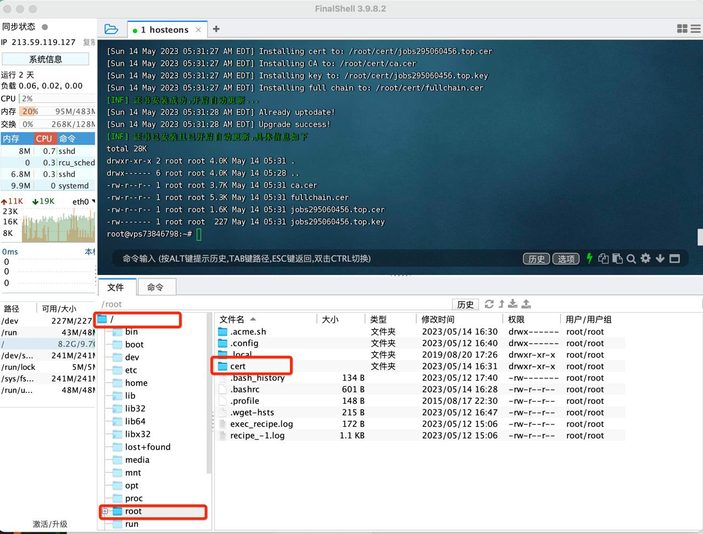


#### 3.7.4、`X-UI`面板证书设置

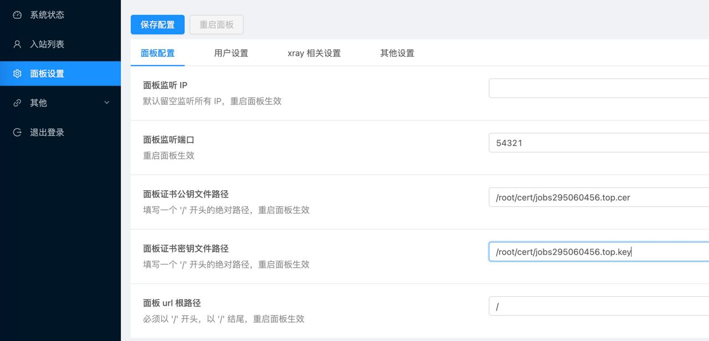

*保存并重启`X-UI` 面板后以`https`的形式进入`X-UI`面板*

```javascript
open https://hello.jobs295060456.top:54321/
```

### 3.8、在`X-UI`面板里面部署入站节点

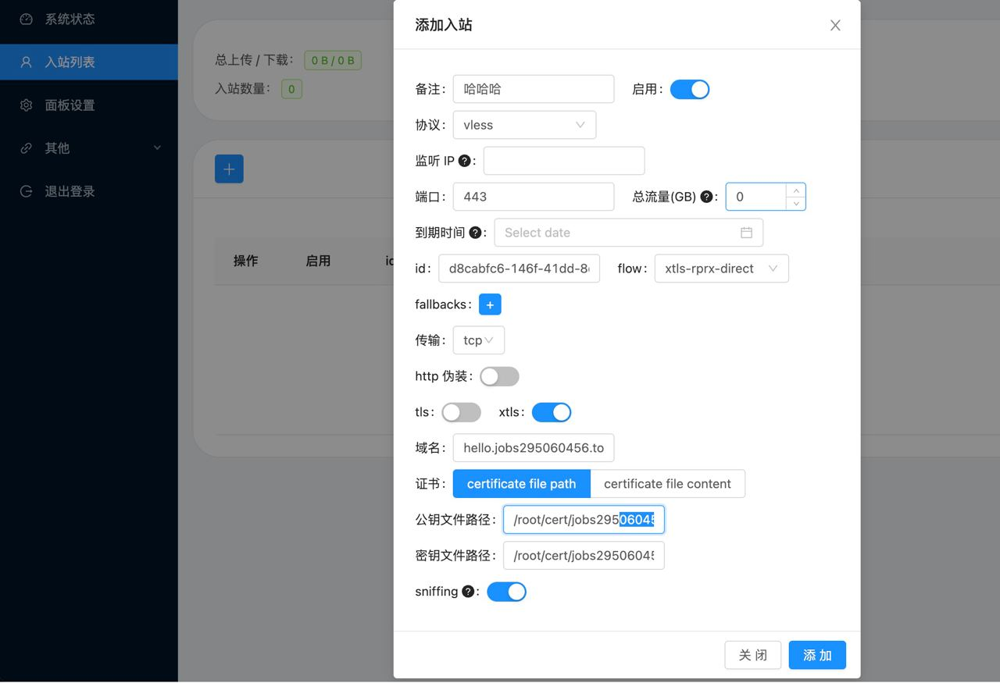

```
点击操作👉🏻二维码👉🏻复制:

vless://d8cabfc6-146f-41dd-8d48-59000cf10df8@hello.jobs295060456.top:443?type=tcp&security=xtls&flow=xtls-rprx-direct#%E5%93%88%E5%93%88%E5%93%88
```

### 3.9、使用`Qv2ray`

#### 3.9.1、安装

```bash
open https://formulae.brew.sh/cask/qv2ray
brew install --cask qv2ray
```

#### 3.9.2、数据导入

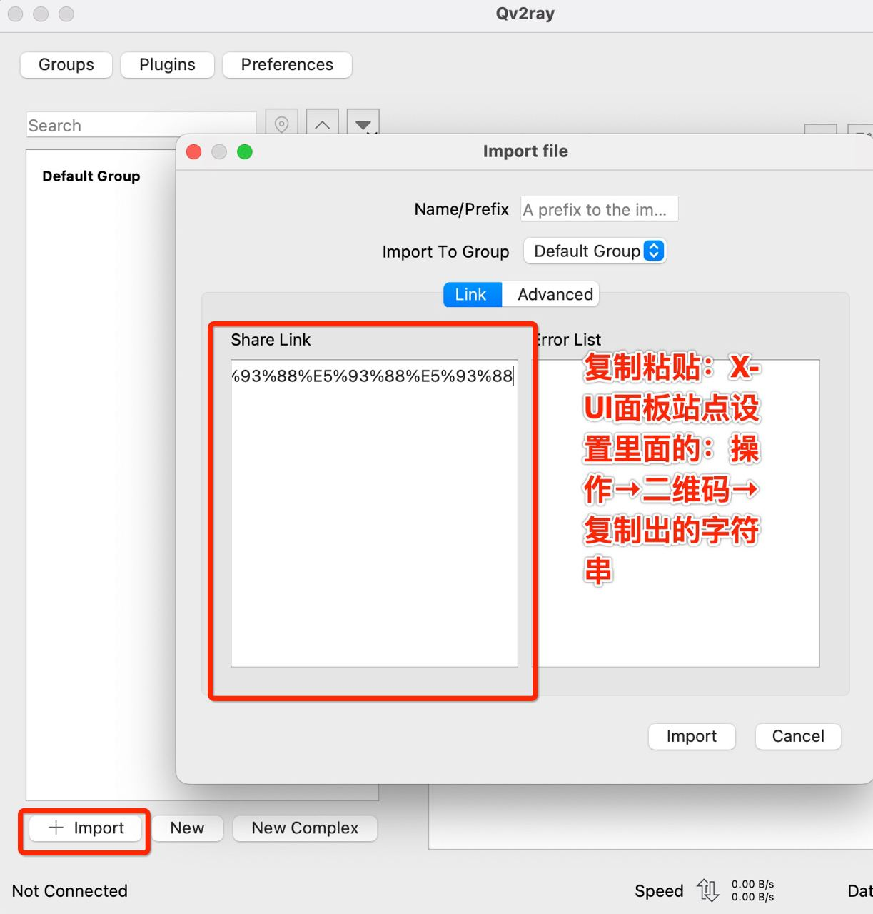


### 3.10、IP优选：套用CDN拯救线路

#### 3.10.1、准备工作

##### 3.10.1.1、断开Qv2ray链接并删除(图略)

##### 3.10.1.2、在X-UI面板-入站列表里面，删除刚才配置的节点(图略)

#### 3.10.2、操作流程

##### 3.10.2.1、打开DNS：Cloudflare，找到解析域名的地方，开启代理

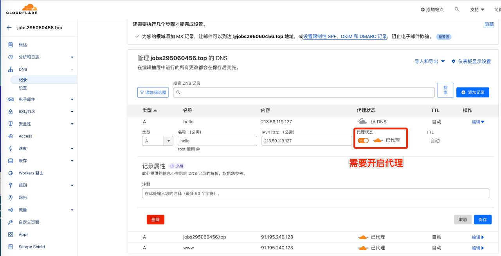

##### 3.10.2.2、Cloudflare里面SSL/TLS 加密模式设置为完全（严格）

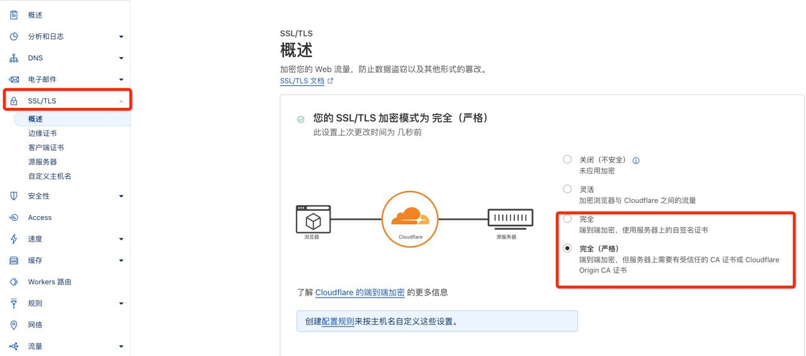

##### 3.10.2.3、在`X-UI`面板里面建立`VLESS+WS+TLS`的代理节点

*检验`Cloudflare`域名是否代理成功生效*


*因为代理成功生效，此时访问以下👇🏻域名是不成功的*

```javascript
open https://hello.jobs295060456.top:54321/
```

此时只能通过以下👇🏻形式访问`X-UI`面板

```javascript
open http://213.59.119.127:54321/xui/
```

*X-UI面板设置WS协议*


*和之前的操作一样，复制二维码分享链接，利用`Qv2ray`进行导入*

**注：但是要对节点进行修改以后才可使用**

##### 3.10.2.4、Cloudflare设置请求头

*设置请求头为：host|hello.jobs295060456.top*

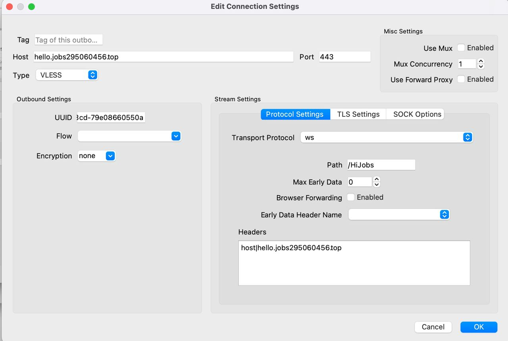

##### 3.10.2.5、Cloudflare设置服务器地址

*服务器地址为:hello.jobs295060456.top*

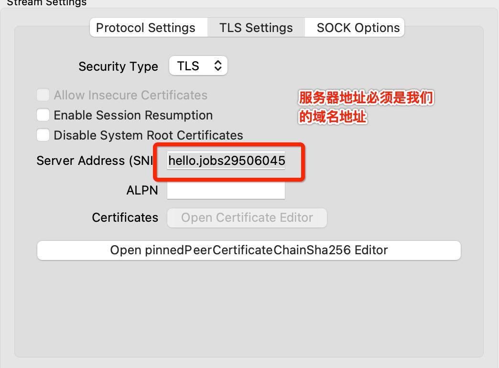

**双击节点并进行使用**