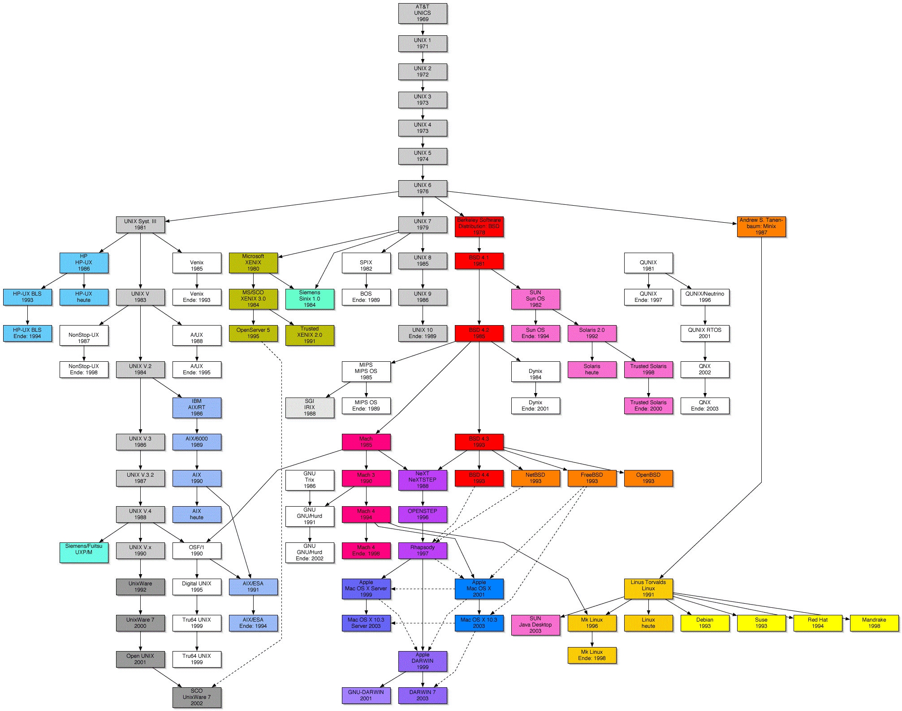

# 运维成长路线

## 1、服务器系统

*提纲*

```
Linux:Unix系统上面做的封包，红帽系统是基于Linux基础上的，主要是加了一些UI的修改，有庞大的社区生态、
CentOS:用版本7，一般不使用版本8。原因：版本8变化大、不稳定、收费，基于JDK11，如果代码是使用低版本JDK就要面临修改代码、
ubuntu:什么版本都可以，区别不大、

UNIX:一般不使用这个系统。某些航空系统 和 Mac系统基于这个系统开发。这个系统适用于单片机，没有定义网络协议等基础架构，开放性很高
```

*单片机 = single-chip microcomputer = 单晶片 = 单片微型计算机 = 微控制器单元 = microcontroller unit*

[单片机的基本构成、工作原理](https://www.renesas.cn/cn/zh/support/engineer-school/mcu-01-basic-structure-operation)

[快懂百科/单片机](https://www.baike.com/wikiid/6566733141578866922?view_id=3ygk48uoh06000)

```
1、是把中央处理器、存储器、定时/计数器、各种输入/输出接口等都集成在一块集成电路芯片上的微型计算机;
2、与应用在个人电脑中的通用型微处理器相比:
		2.1、它更强调自供应（不用外接硬件）和节约成本，整合程度更高;
		2.2、但因为规格已经包含，所能实现的功能也较专一;
		2.3、最大优点是体积小，可放在仪表内部;
		2.4、但存储量小，输入输出接口简单;
		2.5、随着发展，在很多应用场合被称为:范围更广的微控制器;
		2.6、微控制器是一种面向控制领域嵌入式应用的集成化计算机芯片，主要用于工业控制、数据处理、信号处理、智能仪器、通信产品及民用消费产品等自动控制产品与器件中;
3、单片机的软件开发:
		3.1、以往多使用汇编语言;
		3.2、如今越来越多的使用C语言;
		3.3、又或者使用 BASIC 语言等更适合初学者的语言，部分集成开发环境支持C++;
		3.4、单片机的软件测试需要使用单片机开发器或模拟器;
		3.5、2000年后已经有很多单片机自带了ISP（在线编程设计）或支持 IAP，彻底地改变了传统的开发模式。使得开发单片机系统时不会损坏芯片的引脚。
		加速了产品的上市并降低了研发成本，缩短了从设计、制造到现场调试的时间，简化了生产流程，大大提高了工作效率。
		3.6、软件开发环境:
				3.6.1、微芯公司的 MPLAB IDE 可用于该公司全系列微控制器的开发与除错;
				除支持该公司的 ASM组译器 C语言编译器外，也支援许多第三方的编译器;
				3.6.2、ARM公司的 μVision 整合开发环境（原为 Keil 公司产品，2005年该公司已由 ARM 购并）;
				包含组译器与 C编译器，可用于51单片机及ARM开发;
				3.6.3、ARM公司的 Mbed，可以使用线上IDE来开发;
				3.6.4、Proteus 软件是初学者入门的首选软件，它是 Labcenter Electronics 公司的一款商业版电路设计与仿真软件;
				内包括ISIS、ARES等软件模块;
				3.6.4.1、ARES 模块主要用来完成PCB的设计;
				3.6.4.2、ISIS 模块用来完成电路原理图的布图与仿真;
				Proteus的软件仿真基于VSM技术，它与其他软件最大的不同也是最大的优势就在于能仿真大量的单片机芯片，比如MCS-51系列、PIC系列等等，甚至ARM处理器，以及单片机外围电路，比如键盘、LED、LCD等等。该软件还附带了一些案例和丰富的帮助文件。
4、单片机的硬件开发:
		开发板可以进一步简化程序的开发和烧制过程。
		4.1、开发板可能包含实际芯片或是仿真器;
		4.2、通过配套的下载线连接电脑与开发板，在电脑上编写程序下载到开发板;
		4.3、批量生产会用到编程器;
```

*资料来源*

[类UNIX操作系统家族发展时间线图谱（1969-2020）](https://blog.csdn.net/Rong_Toa/article/details/109560770)

[知乎/一图看懂UNIX、BSD、MINIX&GNU/LINUX 的爱恨情仇](https://zhuanlan.zhihu.com/p/156109072)

[维基百科/GNU](https://zh.wikipedia.org/wiki/GNU)

[UNIX 官网](https://unix.org/)

[维基百科/UNIX](https://zh.wikipedia.org/wiki/UNIX)

[Linux 官网](https://www.linux.org/)

[维基百科/Linux](https://zh.wikipedia.org/zh-hans/Linux)

[w3cschool/Linux教程](https://www.w3cschool.cn/linux/)

[runoob/Linux教程](https://www.runoob.com/linux/linux-tutorial.html)

[维基百科/MacOS](https://zh.wikipedia.org/wiki/MacOS)

[Ubuntu 官网](https://ubuntu.com/)

[维基百科/Ubuntu](https://zh.wikipedia.org/wiki/Ubuntu)

[Debian 官网](https://www.debian.org/)

[维基百科/Debian](https://zh.wikipedia.org/wiki/Debian)

### 1.1、UNIX

***UNIX** = **UN**iplexed **I**nformation and Computing **S**ervice，UnICS = 非复用信息和计算机服务*

*而 **X** 则表明其对 Unix API 的传承*

#### 1.1.1、简介

```
1、最早由 肯·汤普逊、丹尼斯·里奇 和 道格拉斯·麦克罗伊 于1969年，在美国 AT&T 公司的"贝尔实验室"开发的 AT&T Unix;
		1.1、Unix 的前身为1964年开始的 Multics
		1.2、低成本授权的使用，在母本基础上孕育了许多"变种"。最著名的"变种"之一即:伯克利套件（BSD）;
		1.3、BSD 在 Unix 的历史发展中具有相当大的影响力，被很多商业厂家采用，成为很多商用 Unix 的基础;
		1.4、为避免版权问题，将来自于 AT&T 的代码完全删除，于是诞生了4.4 BSD Lite版（所有自由版本的基础）;
		1.5、1994年，受到GNU工程的鼓舞，BSD走上了复兴的道路。
				1.5.1、BSD 的开发也走向了几个不同的方向，并最终导致了 FreeBSD、NetBSD、OpenBSD、DragonFlyBSD 等基于 BSD 的操作系统的出现;
2、一种多用户、多进程、多任务的计算机操作系统;
3、支持多种处理器架构，属于"分时操作系统";
4、代码实现:由PDP-7汇编语言逐步过渡到C语言
		4.1、第一版 UNIX 是用PDP-7汇编语言编写的，一些应用是由叫做B语言的解释型语言和汇编语言混合编写的;
		4.2、因为PDP-7的性能不佳，肯·汤普逊与丹尼斯·里奇决定把第一版UNIX移植到PDP-11/20的机器上，开发第二版UNIX;
				4.2.1、在性能提升后，真正可以提供多人同时使用。布莱恩·柯林汉 提议将它的名称改为UNIX;
		4.3、在进行系统编程时不够强大，所以汤普逊和里奇对其进行了改造，并于1971年共同发明了C语言;
		4.4、1973年汤普逊和里奇用C语言重写了 UNIX，形成第三版 UNIX;
		所以汤普逊和里奇此举是极具大胆创新和革命意义的。用C语言编写的 UNIX 代码简洁紧凑、易移植、易读、易修改，为此后 UNIX 的发展奠定了坚实基础。
5、广泛的应用:
		5.1、UNIX 因为其安全可靠，高效强大的特点在服务器领域得到了广泛的应用;
		5.2、直到 GNU/Linux 流行开始前，UNIX 也是科学计算、大型机、超级计算机等所用操作系统的主流;
		5.3、现在其仍然被应用于一些对稳定性要求极高的数据中心之上;
6、设计哲学:
    UNIX 的部分设计原则：
		6.1、简洁至上 = KISS原则 =  Keep It Simple, Stupid = 是一种归纳过的经验原则 = 在设计当中应当注重简约
    6.2、提供机制而非策略
		6.3、更糟就是更好:软件的品质（受欢迎的程度）并不随着功能的增加而提高，从实用性以及易用性来考虑，功能较少的软件反而更受到使用者和市场青睐;
7、后世鼻祖:是现在各种 UNIX-like 系统的起源，包括 Linux、MacOX、BSD，要么是从UNIX系统衍生而来，要么是模仿UNIX的系统;
8、值得注意的是，UNIX 现在并不是开源的（半开源或者闭源）
```

#### 1.1.2、POSIX

***POSIX** = **P**ortable **O**perating **S**ystem **I**nterface = 可移植操作系统接口*

```
1、一个执行标准:从1980年代开始，POSIX，一个开放的操作系统标准就在制定中，IEEE 制定的 POSIX标准（ISO/IEC 9945）现在是 UNIX 系统的基础部分;
2、是 IEEE 为要在各种 UNIX 操作系统上运行软件，而定义 API 的一系列互相关联的标准的总称;
3、Linux 基本上逐步实现了 POSIX 兼容，但并没有参加正式的 POSIX 认证。微软的 Windows NT 声称部分实现了POSIX标准;
4、当前的POSIX主要分为四个部分:Base Definitions、System Interfaces、Shell and Utilities、Rationale;
```

#### 1.1.3、BSD

***BSD** = **B**erkeley **S**oftware **D**istribution = 伯克利软件包 = **伯克利 Unix **或 Berkeley Unix*

```
1、是一个派生自 UNIX（类UNIX）的操作系统，可应用于多种硬件构架;
2、1970年代由伯克利加州大学的学生比尔·乔伊开创;
3、也被用来代表其派生出的各种包;
4、BSD许可证非常地宽松，因此 BSD 常被当作工作站级别的 UNIX 系统;
5、BSD 的早期版本被用作组建 Sun 公司的 SunOS，造就了 UNIX 工作站的第一波热潮;
6、跟 AT&T Unix 一样，BSD 也采用单内核，这意味着内核中的设备驱动，在核心态下运行，从而作为操作系统的核心部分;
7、由于 BSD 设计出众，代码编写清晰，包括它的文档（特别是参考文档，常被称为"man pages"），使得这样的系统，几乎成为程序员眼中的乐土;
8、时至今日，BSD 仍在学术机构，乃至许多商业或自由产品的高科技实验中，继续被用作试验平台，甚至在嵌入式设备中，其使用也在增长;
9、兼容性:
		9.1、通过一个二进制兼容层（compatibility layer），在 BSD 操作系统上，可以运行相同构架下其他操作系统上的原程序;
		9.2、效率高于模拟器，针对 Linux 的应用程序，也可以在 BSD 上全速运行;
		9.3、BSD 不仅适合作为服务器，也可作为工作站来使用;
		9.4、当前的 BSD操作系统变种支持各种通用标准，包括 IEEE、ANSI、ISO、POSIX，同时保持传统 BSD 的良好风范;
```

#### 1.1.4、类UNIX系统家族




### 1.2、Linux

```
1、1990年，Linus Torvalds 决定编写一个自己的 Minix 内核，初名为 Linus' Minix，意为 Linus 的 Minix 内核，后来改名为 Linux;
		1.1、此内核于1991年正式发布，并逐渐引起人们的注意;
		1.2、当时GNU操作系统仍未完成。GNU系统软件集与Linux内核结合后，GNU软件构成了这个POSIX兼容操作系统GNU/Linux的基础;
		1.3、今天GNU/Linux已经成为发展最为活跃的自由／开放源码的类Unix操作系统;
```

### 1.3、MacOS

*Apple 苹果公司推出的使用图形用户界面的操作系统，为麦金塔（Macintosh，简称 Mac）系列电脑的主操作系统;*

```
1、版本命名:
		1.1、以前版本的 macOS 以大型猫科动物命名;
		1.2、2011年及之前称 MacOS X;
		1.3、2012年~2015年称 OS X;
		1.4、2016年6月，苹果公司宣布 OS X 更名为 macOS
2、Mac OS X ≠  Mac OS，彻底分离;
		2.1、它的底层代码与先前版本完全不同。
		2.2、这个新的核心名为 Darwin。是一套开放源码、符合 POSIX 标准的操作系统，伴随着标准的 Unix 命令行与其强大的应用工具。
3、macOS 包含两个主要的部分:
		macOS = (Mach 内核 + UNIX 的 BSD 实现) => NeXTSTEP + Aqua(UI)
		3.1、名为 Darwin 的核心，以 BSD 源代码和 Mach 微内核为基础，由苹果公司和独立开发者社群合作开发;
		3.2、及一个由苹果公司开发，名为 Aqua 的专有图形用户UI界面;
		
		
```

### 1.4、Ubuntu（乌班图）

*名称来自非洲南部祖鲁语或科萨语的"Ubuntu"一词（译为乌班图），意思是"人性"、""我的存在是因为大家的存在""。是非洲传统的一种价值观。*

```
1、基于 Debian，以桌面应用为主的 Linux 发行版;
2、目前最多用户的 Linux 版本;
3、由英国肯诺有限公司发布，并提供商业支持;
4、编程语言:	C++、C语言、Unix shell、Python;
5、正式版本:
		5.1、桌面版;
		5.2、服务器版;
		5.3、用于物联网设备和机器人的 Core 版;
```

### 1.5、Debian

```
1、Debian是完全由自由软件组成的类 UNIX 操作系统;
2、其包含的多数软件使用GNU通用公共许可协议授权;
3、并由Debian计划的参与者组成团队对其进行打包、开发与维护;
4、是Linux发行版之一;
5、Debian主要分三个版本：稳定版本（stable）、测试版本（testing）、不稳定版本（unstable）;
6、Debian sid = Debian unstable，即不稳定版本。凡是 Debian 要收录的软件都必须首先放在这个版本里面进行测试，等到足够稳定以后会放到 testing 版本里面;
7、Debian 以稳定性闻名，所以很多服务器都使用 Debian 作为其操作系统;
```

## 2、服务器设置

```
shell命令、
定时器contable怎么用、
设置服务器语言，时区，Linux网络防火墙设置、
Linux文档服务器ftp、
网络磁盘、
文件夹映射（内链接），也就是快捷方式、
Linux 文件同步工具——rsync
```

## 3、域名类

```
买域名+域名解析、
CDN配置、
申请https证书（用脚本申请 + 用宝塔x-UI面板申请）
```

```
nginx证书配置，80端口443端口跳转
```

## 4、跳板机

```
vps，vpn的服务、
跳板机的vpn的插件，很多有兼容性问题，找一个好的，拨号到服务器上
端口映射，买一台服务器，frp软件
```

## 5、Docker

```
docker部署、
打镜像、
拉镜像、
```

## 6、Java支持

```
java.jdk安装、
设置环境变量、
jar包和var包的部署、
会产生日志，怎么去拿、
elk日志图形展示、
```

## 7、数据库

```
mysql主备、
mysql.blog同步、
redis设置账号密码，设置集群
```

